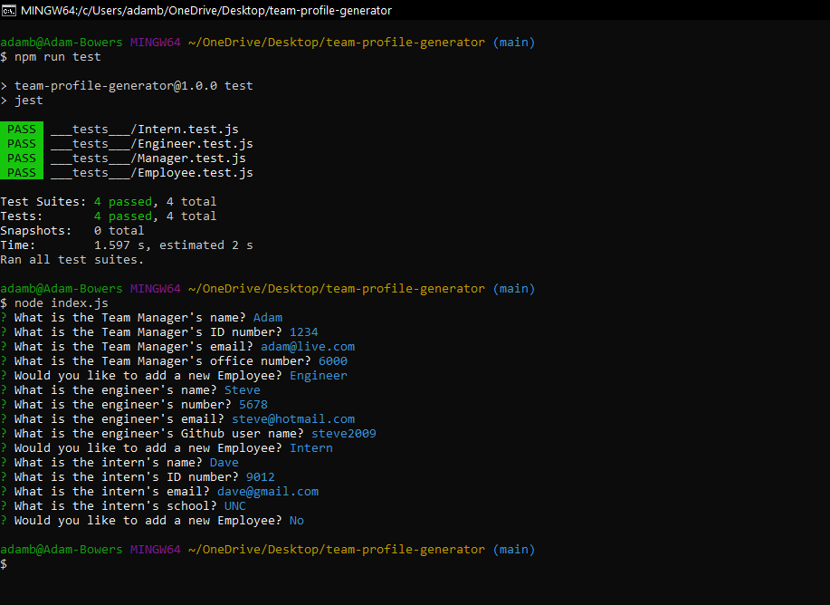

# team-profile-generator

## Description

This project is designed to generate an HTML page containing a roster for a software engineering team.  This was written using Javascript and should be run using Node.js.  The Node package inquirer is used to provide a command line interface and the jest package is used to validate classes.

## Technologies Used
 * Node.js
 * HTML
 * CSS
 * Javascript
 * Inquirer
 * Jest

 ## GitHub & Video Link

 [Link to the repository](https://github.com/adambowers09/team-profile-generator)

 [Link to the vido](https://drive.google.com/file/d/1eAP_TuIYaIrDhDUG0EiAQIOUEWC-Syub/view)

 ## Installation

 Server must has Node.js installed.  Run "npm i" from the root directory to install required dependencies.

 ## Usage

 Run "node index.js" and follow the user prompts to provide information about each employee.  Upon completion it will generate a "New.Team.html" in the /dist directory.

 ## Screenshot
 
 